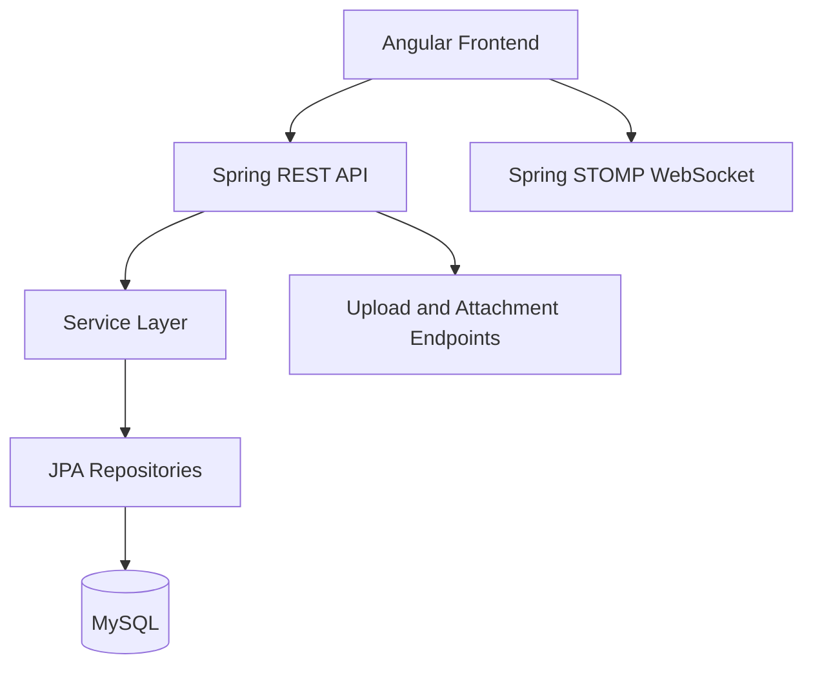

# Elif

<p align="center">
  
</p>

<p align="center">
  Full-stack pet-care platform with Front Office user journeys and Back Office operational workflows.
</p>

<p align="center">
  
  
  
  
  
  
</p>

## What This Repository Contains

Elif is a modular monorepo with:

- Angular frontend for user-facing and admin-facing interfaces.
- Spring Boot backend using layered packages (controllers, services, repositories, DTOs, entities).
- Shared SQL seed data for quick local setup and demos.
- Domain modules spanning community, marketplace, pets, adoption, events, transit, services, and users.

## Tech Stack

| Layer       | Technology                                                                | Version Source                      |
| ----------- | ------------------------------------------------------------------------- | ----------------------------------- |
| Frontend    | Angular 18, TypeScript 5.5, RxJS 7.8, Tailwind 3.4, Angular Material 18   | frontend/package.json               |
| Backend     | Spring Boot 3.5.11, Java 17, Spring Data JPA, WebSocket STOMP, Validation | backend/pom.xml                     |
| Database    | MySQL (runtime connector via mysql-connector-j)                           | backend/pom.xml                     |
| Build Tools | npm, Angular CLI, Maven Wrapper                                           | frontend/package.json, backend/mvnw |

## High-Level Architecture



## Module Landscape

### Frontend (frontend/src/app)

- auth
- front-office
  - community
  - marketplace
  - pet-profiles
  - pet-transit
  - adoption
  - events
  - services
  - dashboard
  - landing
- back-office
  - community
  - marketplace
  - pets
  - transit
  - service-management
  - users
  - adoption
  - events
- shared

### Backend (backend/src/main/java/com/elif)

- controllers
  - adoption, community, marketplace, pet_profile, pet_transit, user
- services
  - adoption, community, marketplace, pet_profile, pet_transit, user
- repositories
  - adoption, community, marketplace, pet_profile, pet_transit, user
- entities
  - adoption, community, marketplace, pet_profile, pet_transit, user
- dto
  - adoption, community, marketplace, pet_profile, pet_transit, user
- config, exceptions, scheduler

## Product Domains

| Domain       | Frontend Area                                         | Backend Packages                                                     | Purpose                                                     |
| ------------ | ----------------------------------------------------- | -------------------------------------------------------------------- | ----------------------------------------------------------- |
| Community    | front-office/community, back-office/community         | controllers/services/repositories/entities/dto/community             | discussions, comments, voting, messaging, realtime presence |
| Marketplace  | front-office/marketplace, back-office/marketplace     | controllers/services/repositories/entities/dto/marketplace           | product catalog, cart, order lifecycle                      |
| Pet Profiles | front-office/pet-profiles, back-office/pets           | controllers/services/repositories/entities/dto/pet_profile           | pet records and profile management                          |
| Pet Transit  | front-office/pet-transit, back-office/transit         | controllers/services/repositories/entities/dto/scheduler/pet_transit | transport planning and operational tracking                 |
| Adoption     | front-office/adoption, back-office/adoption           | controllers/services/repositories/entities/dto/adoption              | adoption workflows and records                              |
| Events       | front-office/events, back-office/events               | shared backend module organization                                   | event listing and operational handling                      |
| Services     | front-office/services, back-office/service-management | shared backend module organization                                   | service offers and management workflows                     |
| Users/Auth   | auth, back-office/users                               | controllers/services/repositories/entities/dto/user                  | identity, login, user administration                        |

## Repository Structure

```text
Elif/
  backend/
    community_demo_seed.sql
    pom.xml
    mvnw
    mvnw.cmd
    src/main/java/com/elif/
    src/main/resources/application.properties
  frontend/
    package.json
    angular.json
    src/app/
    public/images/
  design-system/
    elif/MASTER.md
  MARKETPLACE_QUICK_START.md
  MARKETPLACE_IMPLEMENTATION.md
```

## Local Setup

### Prerequisites

- Node.js 20+
- npm
- Java 17
- MySQL 8+

### 1) Database

The backend defaults to:

- DB: `Elif`
- URL: `jdbc:mysql://localhost:3306/Elif?createDatabaseIfNotExist=true`
- User: `root`
- Password: empty

Import seed data:

```bash
bash backend/run_demo_seeds.sh
```

The seed runner applies:

- `backend/user_demo_seed.sql`
- `backend/community_demo_seed.sql`
- `backend/pet_profile_demo_seed.sql`
- `backend/adoption_demo_seed.sql`
- `backend/marketplace_demo_seed.sql`
- `backend/pet_transit_demo_seed.sql`

Optional environment overrides for the runner:

```bash
DB_HOST=127.0.0.1 DB_PORT=3306 DB_NAME=Elif DB_USER=root DB_PASSWORD='' bash backend/run_demo_seeds.sh
```

### 2) Backend

From backend folder (macOS/Linux):

```bash
./mvnw spring-boot:run
```

From backend folder (Windows):

```powershell
mvnw.cmd spring-boot:run
```

Backend base URL:

- http://localhost:8087/elif

### 3) Frontend

From frontend folder:

```bash
npm install
npm start
```

Frontend URL:

- http://localhost:4200

## Environment Variables

The backend imports env values from local `.env` files via:

- `optional:file:.env[.properties]`
- `optional:file:../.env[.properties]`

Key optional variables:

| Variable               | Purpose                                     |
| ---------------------- | ------------------------------------------- |
| `GIPHY_API_KEY`        | GIF search for community chat/comment flows |
| `STRIPE_SECRET_KEY`    | Stripe integration                          |
| `SPRING_MAIL_HOST`     | SMTP host                                   |
| `SPRING_MAIL_PORT`     | SMTP port                                   |
| `SPRING_MAIL_USERNAME` | SMTP username                               |
| `SPRING_MAIL_PASSWORD` | SMTP password                               |
| `APP_MAIL_FROM`        | sender address override                     |

## Build and Test Commands

### Frontend

```bash
npm run build
npm run test
```

### Backend (macOS/Linux)

```bash
./mvnw -DskipTests compile
./mvnw test
```

### Backend (Windows)

```powershell
mvnw.cmd -DskipTests compile
mvnw.cmd test
```

## API and Runtime Notes

- REST base path: `/elif`
- Community WebSocket endpoint: `/elif/ws-community`
- Upload base directory: `uploads`
- Multipart max file/request size: `10MB`

## Community AI Agent

- Natural-language community search agent repository: [AtfastrSlushyMaker/elif-community-ai-agent-nl](https://github.com/AtfastrSlushyMaker/elif-community-ai-agent-nl)

## Frontend Route Areas

Primary navigation entry points in the app shell:

- `/app/community`
- `/app/marketplace`
- `/app/pet-profiles`
- `/app/pet-transit`
- `/app/adoption`
- `/app/events`
- `/app/services`

Back-office operational areas:

- `/admin/community`
- `/admin/marketplace`
- `/admin/pets`
- `/admin/transit`
- `/admin/adoption`
- `/admin/events`
- `/admin/services`
- `/admin/users`

## Documentation Index

### Platform-Level Docs

- [MARKETPLACE_QUICK_START.md](MARKETPLACE_QUICK_START.md)
- [MARKETPLACE_IMPLEMENTATION.md](MARKETPLACE_IMPLEMENTATION.md)
- [Community AI Agent (external)](https://github.com/AtfastrSlushyMaker/elif-community-ai-agent-nl)
- [design-system/elif/MASTER.md](design-system/elif/MASTER.md)
- [design-system/elif/pages/community.md](design-system/elif/pages/community.md)
- [frontend/README.md](frontend/README.md)

### Architecture and Setup Coverage

- This root file is the whole-project onboarding and architecture map.
- Marketplace has dedicated implementation and quick-start docs.
- Community currently has the deepest folder-level engineering docs.
- Other modules are represented in code structure and are good candidates for the same deep-doc pattern.

### Community Deep Docs (Frontend)

- [frontend/src/app/front-office/community/README.md](frontend/src/app/front-office/community/README.md)
- [frontend/src/app/front-office/community/components/README.md](frontend/src/app/front-office/community/components/README.md)
- [frontend/src/app/front-office/community/models/README.md](frontend/src/app/front-office/community/models/README.md)
- [frontend/src/app/front-office/community/services/README.md](frontend/src/app/front-office/community/services/README.md)

### Community Deep Docs (Backend)

- [backend/src/main/java/com/elif/controllers/community/README.md](backend/src/main/java/com/elif/controllers/community/README.md)
- [backend/src/main/java/com/elif/services/community/README.md](backend/src/main/java/com/elif/services/community/README.md)
- [backend/src/main/java/com/elif/entities/community/README.md](backend/src/main/java/com/elif/entities/community/README.md)
- [backend/src/main/java/com/elif/repositories/community/README.md](backend/src/main/java/com/elif/repositories/community/README.md)
- [backend/src/main/java/com/elif/dto/community/README.md](backend/src/main/java/com/elif/dto/community/README.md)

## Seed Accounts (Demo)

- admin1@elif.com / password
- admin2@elif.com / password
- vet1@elif.com / password
- provider1@elif.com / password
- user1@elif.com / password
- user2@elif.com / password
- user3@elif.com / password
- user4@elif.com / password
- user5@elif.com / password
- user6@elif.com / password

## Operational Notes

- The platform uses modular REST packages by domain under one backend service.
- Realtime STOMP is currently used in the community messaging and presence flows.
- The `uploads` folder contains runtime data and should be treated as environment-specific state.
- Database schema evolves via JPA update mode in local development.
