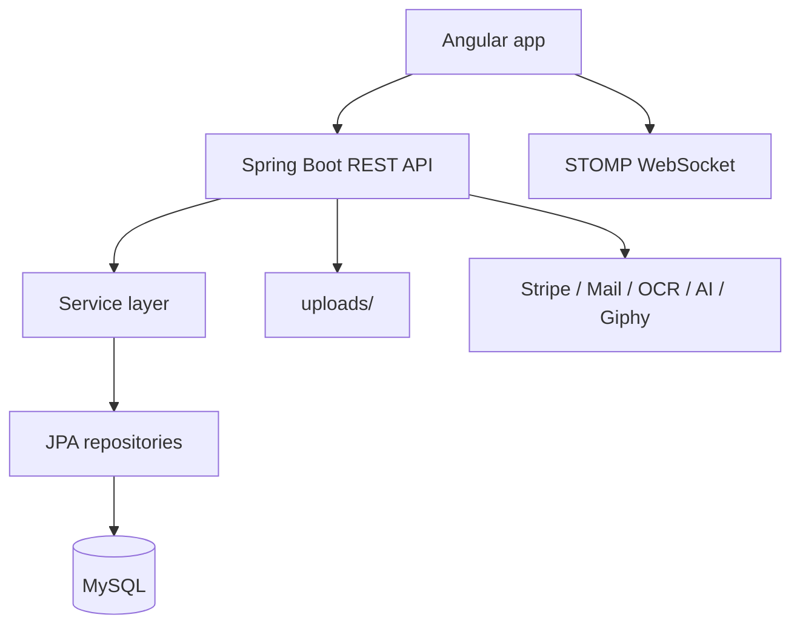

# Elif

<p align="center">
  
</p>

<p align="center">
  Full-stack pet-care platform with Angular front-office and admin back-office experiences backed by a single Spring Boot API.
</p>

<p align="center">
  
  
  
  
  
</p>

## Overview

Elif is a monorepo for a pet platform that combines:

- a public-facing app for pet owners, shelters, providers, and admins
- an admin workspace for operational workflows
- a Spring Boot backend that serves REST APIs, file uploads, scheduled jobs, email flows, PDF exports, and realtime notifications

The project is organized by business domain rather than by technical feature alone. The major product areas currently present in code are:

- Community: communities, posts, comments, votes, realtime chat, mentions, moderation, notifications
- Marketplace: product catalog, cart, Stripe checkout, orders, invoices, reclamations
- Pet Profiles: pet records and admin pet management
- Pet Transit: destinations, travel plans, OCR document analysis, checklist flows, feedback, exports
- Adoption: shelters, appointments, animals, contracts, PDFs, approval emails
- Events: listings, registration, waitlist, reminders, virtual sessions, certificates
- Services: service discovery and management
- Users/Auth: login, registration, roles, back-office user administration

## Architecture



## Repository Layout

```text
Elif/
  backend/         Spring Boot application
  frontend/        Angular application
  design-system/   design references and UI guidance
  .github/         repo-level assistant/editor guidance
  README.md
  MARKETPLACE_QUICK_START.md
  MARKETPLACE_IMPLEMENTATION.md
```

### Frontend

Main app areas under `frontend/src/app`:

- `auth`
- `front-office`
  - `landing`
  - `dashboard`
  - `community`
  - `marketplace`
  - `pet-profiles`
  - `pet-transit`
  - `adoption`
  - `events`
  - `services`
- `back-office`
  - `users`
  - `community`
  - `pets`
  - `transit`
  - `service-management`
  - `adoption`
  - `events`
  - `marketplace`
- `shared`

### Backend

Main backend packages under `backend/src/main/java/com/elif`:

- `controllers`
  - `adoption`
  - `community`
  - `events`
  - `marketplace`
  - `notification`
  - `pet_profile`
  - `pet_transit`
  - `user`
- `services`
  - `adoption`
  - `community`
  - `events`
  - `marketplace`
  - `notification`
  - `pet_profile`
  - `pet_transit`
  - `user`
- `repositories`
- `entities`
- `dto`
- `config`
- `exceptions`
- `scheduler`

## Current Runtime Stack

| Layer | Technology |
| --- | --- |
| Frontend | Angular 18.2, TypeScript 5.5, RxJS 7.8, Angular Material 18, Tailwind CSS 3.4 |
| Backend | Spring Boot 3.5.11, Java 17, Spring Web, Spring Data JPA, Validation, WebSocket/STOMP |
| Database | MySQL 8 via `mysql-connector-j` |
| Payments | Stripe |
| Messaging / Email | Spring Mail |
| Media / Docs | Multipart uploads, PDF generation/export |
| Maps / UI extras | Leaflet, Chart.js, Font Awesome, Lucide |
| Realtime | STOMP over WebSocket |

Sources: [frontend/package.json](frontend/package.json), [backend/pom.xml](backend/pom.xml), [backend/src/main/resources/application.properties](backend/src/main/resources/application.properties)

## Frontend Route Map

### Front Office

Top-level app shell lives under `/app`:

- `/app`
- `/app/dashboard`
- `/app/pets`
- `/app/transit`
- `/app/services`
- `/app/adoption`
- `/app/events`
- `/app/marketplace`
- `/app/community`

### Back Office

Admin shell lives under `/admin`:

- `/admin/users`
- `/admin/community`
- `/admin/pets`
- `/admin/transit`
- `/admin/services`
- `/admin/adoption`
- `/admin/events`
- `/admin/marketplace`

The app also includes redirects such as `/community -> /app/community` and `/events -> /app/events`.

## Realtime Features

The backend enables a STOMP broker and exposes the WebSocket endpoint:

- WebSocket endpoint: `/elif/ws-community`
- Broker topics: `/topic/...`
- App destinations: `/app/...`

Realtime is actively used for:

- community presence
- community chat messages
- typing and seen indicators
- navbar notification updates

Key files:

- [backend/src/main/java/com/elif/config/CommunityWebSocketConfig.java](backend/src/main/java/com/elif/config/CommunityWebSocketConfig.java)
- [frontend/src/app/front-office/community/services/community-realtime.service.ts](frontend/src/app/front-office/community/services/community-realtime.service.ts)
- [backend/src/main/java/com/elif/services/notification/AppNotificationService.java](backend/src/main/java/com/elif/services/notification/AppNotificationService.java)

## Integrations and External Services

The codebase currently integrates with or prepares for:

- Stripe checkout for marketplace payments
- SMTP email delivery for events, adoption, transit, and marketplace invoice workflows
- Giphy search for community messaging
- OCR service for transit document analysis
- AI-backed summary/config support via OpenAI, Groq, and Gemini configuration

Important backend config values are defined in [backend/src/main/resources/application.properties](backend/src/main/resources/application.properties).

## Local Development

### Prerequisites

- Node.js 20+ recommended
- npm
- Java 17
- MySQL 8+
- MySQL CLI if you want to use the seed script

### 1. Configure MySQL

Default backend database config:

- host: `localhost`
- port: `3306`
- database: `Elif`
- user: `root`
- password: empty

The backend uses:

- `spring.jpa.hibernate.ddl-auto=update`
- `server.port=8087`
- `server.servlet.context-path=/elif`

### 2. Optional `.env`

The backend reads env values from these locations if present:

- `.env`
- `backend/.env`
- `../backend/.env`
- `../.env`

Useful variables:

| Variable | Purpose |
| --- | --- |
| `STRIPE_SECRET_KEY` | Stripe checkout |
| `SPRING_MAIL_HOST` | SMTP host |
| `SPRING_MAIL_PORT` | SMTP port |
| `SPRING_MAIL_USERNAME` | SMTP username |
| `SPRING_MAIL_PASSWORD` | SMTP password |
| `APP_MAIL_FROM` | sender override |
| `APP_FRONTEND_BASE_URL` | link generation in emails |
| `APP_BACKEND_BASE_URL` | backend link generation |
| `OPENAI_API_KEY` | AI integration config |
| `GROQ_API_KEY` | AI summary config |
| `GEMINI_API_KEY` | AI summary config |
| `GIPHY_API_KEY` | community GIF search |
| `APP_NOTIFICATIONS_COMMUNITY_NEW_POST_ENABLED` | enables broad new-post notifications |

### 3. Seed Demo Data

Run from the repo root:

```bash
bash backend/run_demo_seeds.sh
```

Optional overrides:

```bash
DB_HOST=127.0.0.1 DB_PORT=3306 DB_NAME=Elif DB_USER=root DB_PASSWORD='' bash backend/run_demo_seeds.sh
```

Seed files applied by the script:

- `backend/user_demo_seed.sql`
- `backend/community_demo_seed.sql`
- `backend/pet_profile_demo_seed.sql`
- `backend/adoption_demo_seed.sql`
- `backend/marketplace_demo_seed.sql`
- `backend/pet_transit_demo_seed.sql`

### 4. Run the Backend

macOS/Linux:

```bash
cd backend
./mvnw spring-boot:run
```

Windows:

```powershell
cd backend
mvnw.cmd spring-boot:run
```

Backend base URL:

- `http://localhost:8087/elif`

### 5. Run the Frontend

```bash
cd frontend
npm install
npm start
```

Frontend app URL:

- `http://localhost:4200`

## Build and Test

### Frontend

```bash
cd frontend
npm run build
npm run test
```

### Backend

macOS/Linux:

```bash
cd backend
./mvnw -DskipTests compile
./mvnw test
```

Windows:

```powershell
cd backend
mvnw.cmd -DskipTests compile
mvnw.cmd test
```

## Demo Accounts

From [backend/user_demo_seed.sql](backend/user_demo_seed.sql):

- `admin1@elif.com / password`
- `admin2@elif.com / password`
- `vet1@elif.com / password`
- `provider1@elif.com / password`
- `user1@elif.com / password`
- `user2@elif.com / password`
- `user3@elif.com / password`
- `user4@elif.com / password`
- `user5@elif.com / password`
- `user6@elif.com / password`
- `user7@elif.com / password`
- `user8@elif.com / password`
- `user9@elif.com / password`
- `user10@elif.com / password`
- `user11@elif.com / password`
- `shelter.approved@elif.com / password`
- `shelter.pending@elif.com / password`

## Notable Operational Details

- The backend is a single Spring Boot app serving all domains.
- Notifications are persisted and broadcast in realtime through the shared notification service.
- Community new-post notifications are disabled by default to reduce feed noise.
- Runtime uploads are stored under `backend/uploads` and should be treated as environment-specific state.
- The repo already contains generated/runtime folders like `backend/target` and `backend/uploads`, so keep that in mind when packaging or cleaning environments.
- There is no root Docker Compose setup in this repo at the moment.

## Documentation Index

Primary docs already in the repo:

- [MARKETPLACE_QUICK_START.md](MARKETPLACE_QUICK_START.md)
- [MARKETPLACE_IMPLEMENTATION.md](MARKETPLACE_IMPLEMENTATION.md)
- [design-system/elif/MASTER.md](design-system/elif/MASTER.md)
- [design-system/elif/pages/community.md](design-system/elif/pages/community.md)
- [frontend/README.md](frontend/README.md)

Community-specific deeper docs:

- [frontend/src/app/front-office/community/README.md](frontend/src/app/front-office/community/README.md)
- [frontend/src/app/front-office/community/components/README.md](frontend/src/app/front-office/community/components/README.md)
- [frontend/src/app/front-office/community/models/README.md](frontend/src/app/front-office/community/models/README.md)
- [frontend/src/app/front-office/community/services/README.md](frontend/src/app/front-office/community/services/README.md)
- [backend/src/main/java/com/elif/controllers/community/README.md](backend/src/main/java/com/elif/controllers/community/README.md)
- [backend/src/main/java/com/elif/services/community/README.md](backend/src/main/java/com/elif/services/community/README.md)
- [backend/src/main/java/com/elif/entities/community/README.md](backend/src/main/java/com/elif/entities/community/README.md)
- [backend/src/main/java/com/elif/repositories/community/README.md](backend/src/main/java/com/elif/repositories/community/README.md)
- [backend/src/main/java/com/elif/dto/community/README.md](backend/src/main/java/com/elif/dto/community/README.md)

## Summary

This repo is no longer just a simple Angular + Spring starter. It is a fairly broad multi-domain product with:

- separate front-office and back-office experiences
- domain-organized backend packages
- realtime community and notification flows
- scheduled event and transit workflows
- payment, email, OCR, PDF, and AI-related integrations

If you are onboarding to the project, start with this file, then jump into the domain-specific docs for the area you plan to work on.
