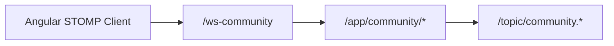

# Backend Config (Community-Relevant)

This folder contains backend configuration classes. For community features, `CommunityWebSocketConfig` is the critical entry.

## Community-Relevant File

- `CommunityWebSocketConfig.java`
  - STOMP endpoint: `/ws-community`
  - Allowed origin pattern: `http://localhost:4200`
  - Application destination prefix: `/app`
  - Simple broker prefixes: `/topic`, `/queue`

## Related Non-Community Config Files

- `WebConfig.java`: general web/CORS concerns.
- `UploadResourceConfig.java`: static/resource upload path handling.
- `SchedulingConfig.java`: scheduler infrastructure.

## Realtime Topology

## Maintenance Notes

- Origin and endpoint values must match frontend `CommunityRealtimeService.wsUrl`.
- For multi-instance production setups, replace the simple broker with external broker infrastructure.
