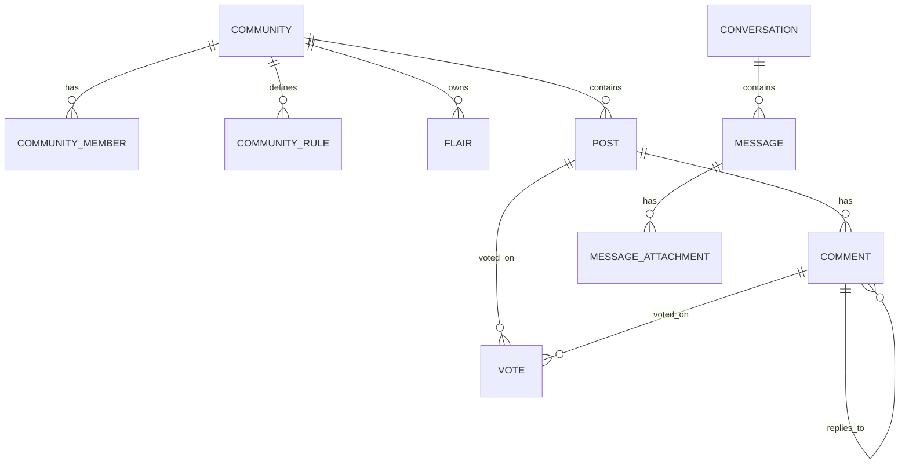

# Community Entities

This folder contains JPA entities for the community domain.

## Entity Inventory

| Entity | Purpose | Key Constraints |
|---|---|---|
| `Community` | community aggregate root | unique `name`, unique `slug`, member count denormalization |
| `CommunityMember` | user membership and role | unique `(community_id, user_id)` |
| `CommunityRule` | ordered community rules | `rule_order` integer |
| `Flair` | per-community post tags | color + textColor defaults |
| `Post` | discussion/question thread | indexes: community, createdAt, voteScore |
| `Comment` | threaded replies | self-reference via `parentComment`, indexes on post/parent |
| `Vote` | polymorphic vote record | unique `(user_id, target_id, target_type)` |
| `Follow` | follow relation for user/community | unique `(follower_id, followee_id, follow_type)` |
| `Conversation` | 1:1 chat container | unique participant pair via canonical ordering |
| `Message` | chat message | index on conversation, soft delete/read timestamps |
| `MessageAttachment` | binary attachment metadata and data | LONGBLOB `fileData` |

## Relationship Sketch

## Soft-Delete Policy

- `Post.deletedAt`, `Comment.deletedAt`, and `Message.deletedAt` are used by repositories/services to hide rows without immediate physical deletion.
- Service mappers replace deleted content with placeholders where needed.

## Serialization Notes

- Bidirectional chat fields use `@JsonIgnore` on relationship edges (`Conversation.messages`, `Message.conversation`) to prevent deep recursion.
- `CommunityRule` and `Flair` suppress community back-reference in JSON using `@JsonIgnore`.
