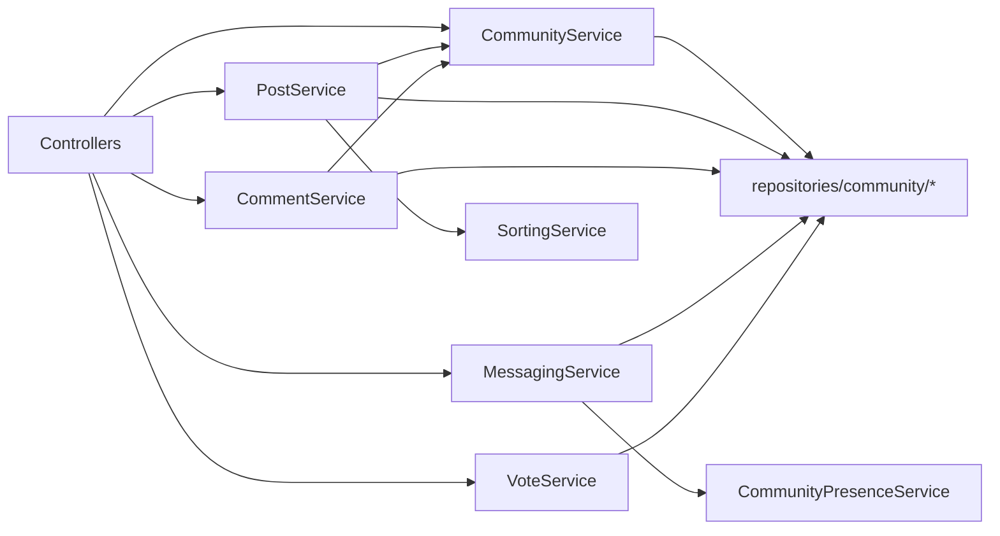

# Community Services

This folder contains business rules for communities, posts, comments, voting, follows, messaging, realtime presence, sorting, and GIF retrieval.

## File Responsibilities

| File | Responsibility |
|---|---|
| `CommunityService.java` | community lifecycle, membership, role checks, rules/flairs management, soft/hard delete |
| `PostService.java` | post CRUD, trending/search, ownership checks, pin/unpin, response mapping |
| `CommentService.java` | comment tree construction, create/edit/delete, accepted-answer rules |
| `VoteService.java` | idempotent vote creation/update/removal + score delta application |
| `MessagingService.java` | conversation/message lifecycle, attachment storage/access checks, inbox mapping |
| `CommunityPresenceService.java` | in-memory session-to-user presence tracking with multi-session counts |
| `FollowService.java` | follow/unfollow/list operations with idempotent create |
| `SortingService.java` | HOT/NEW/TOP/CONTROVERSIAL ordering with pinned-first behavior |
| `GiphyService.java` | external Giphy API client and result parsing |

## Security and Authorization Rules

- `CommunityService.requireModerator`: blocks member-only users from moderation actions.
- `CommunityService.requireCreatorOrAdmin`: used for moderator promotion/demotion.
- `PostService.updatePost`: author-only edits.
- `PostService.softDeletePost`: author or moderator delete.
- `CommentService.updateComment`: author-only edits.
- `CommentService.softDeleteComment`: author or moderator delete.
- `CommentService.acceptAnswer`: post author only; post type must be `QUESTION`.
- `MessagingService`: participant-only read/send and attachment access.

## Data Mutation Patterns

- Soft delete pattern: sets `deletedAt` on posts/comments/messages.
- Hard delete pattern: explicit cleanup of dependent votes/comments/posts where needed.
- Vote updates are delta-based so changing vote from +1 to -1 updates score by -2.

## Service Interaction Diagram

## Maintenance Notes

- `MAX_IMAGE_PAYLOAD_LENGTH` in `CommunityService` is mirrored by frontend guards; keep both synchronized.
- `CommunityPresenceService` is in-memory; horizontal scaling requires shared state (for example Redis).
- `MessagingService.sendImage` currently allows uploaded images or Giphy-hosted remote URLs.
