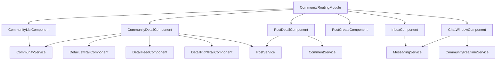

# Community Frontend Feature

This folder contains the full front-office community experience: discovery, community hubs, posting, threaded comments, direct messaging, and realtime presence.

## Folder Map

- `community.module.ts`: feature entry module, wires routes and pages.
- `community-routing.module.ts`: route contract for list/detail/create/post/chat screens.
- `community-pages.module.ts`: declares route-level pages and split detail rails.
- `community-shared.module.ts`: reusable components used by multiple pages.
- `components/`: page components and reusable UI blocks.
- `models/`: typed frontend contracts aligned with backend responses.
- `services/`: HTTP and WebSocket integration layer.

## Route Topology

| Path | Component | Guard |
|---|---|---|
| `` | `CommunityListComponent` | none |
| `create` | `CommunityCreateComponent` | `AuthGuard` |
| `c/:slug` | `CommunityDetailComponent` | none |
| `c/:slug/post/new` | `PostCreateComponent` | `AuthGuard` |
| `post/:id` | `PostDetailComponent` | none |
| `inbox` | `InboxComponent` | `AuthGuard` |
| `chat/:conversationId` | `ChatWindowComponent` | `AuthGuard` |

## End-to-End Flows

1. Discovery: `CommunityListComponent` calls `CommunityService.getAll` and `PostService.getTrending`.
2. Hub: `CommunityDetailComponent` loads community, then flairs/rules/posts/members in parallel.
3. Posting: `PostCreateComponent` resolves community context by slug, then calls `PostService.create`.
4. Discussion: `PostDetailComponent` + `CommentTreeComponent` manage replies, voting, and accepted answer.
5. Messaging: `InboxComponent` starts/opens conversations; `ChatWindowComponent` mixes REST fetch with STOMP subscriptions.

## Security and Contracts

- All write operations pass `X-User-Id` through service helpers.
- Admin impersonation is supported in selected endpoints via `X-Act-As-User-Id`.
- Realtime typing/presence is handled through STOMP destinations under `/app/community/*` and `/topic/community.*`.

## Mermaid Overview

## Maintenance Notes

- Keep component logic orchestration-only; transport concerns belong in `services/`.
- When backend DTOs change, update `models/` first, then component assumptions.
- `CommunityRealtimeService` reconnect policy and URL are environment-sensitive and should be externalized before production.
