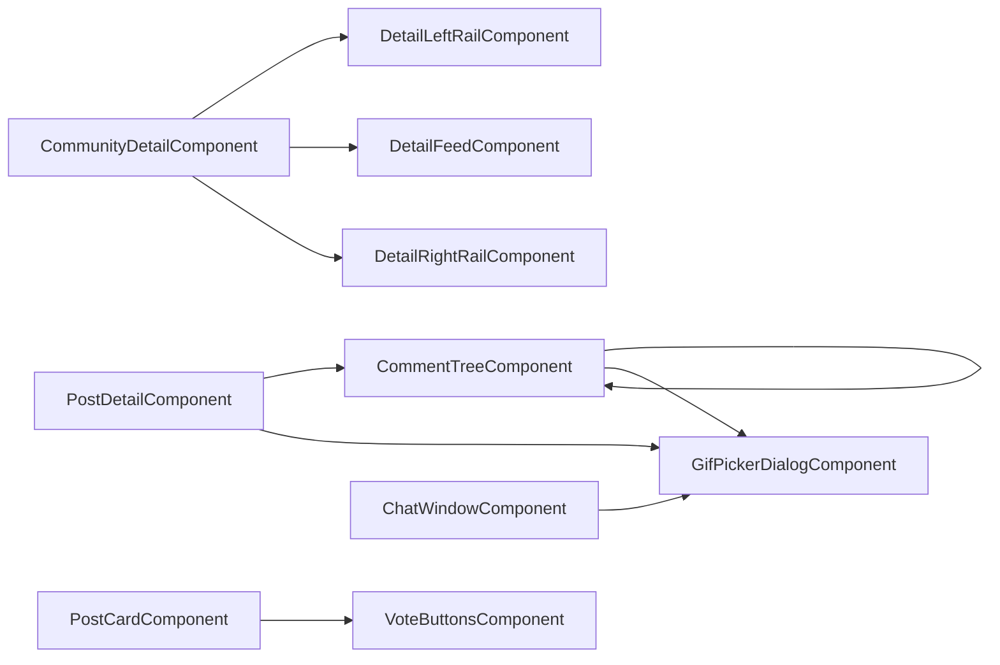

# Community Components

This folder combines route-level pages and reusable composition components.

## Folder Intent

- Route screens orchestrate data loading, auth redirects, and user actions.
- Reusable blocks (`post-card`, `comment-tree`, `vote-buttons`, `flair-badge`) keep repeated UI and interaction behavior centralized.
- `community-detail` is intentionally split into rails/feed subcomponents to reduce template and style bloat.

## Current Components

| Folder | Role |
|---|---|
| `community-list` | discovery page with trending feed and joined grouping |
| `community-detail` | community hub, membership, settings, moderation tools |
| `community-create` | multistep create flow for identity/rules/flairs |
| `post-create` | create thread in selected community |
| `post-detail` | thread page with comments and post moderation |
| `inbox` | conversation list + recipient picker |
| `chat-window` | realtime conversation screen |
| `gif-picker-dialog` | reusable GIF search/pick dialog |
| `post-card` | reusable post preview card |
| `comment-tree` | recursive comment renderer/editor |
| `vote-buttons` | reusable vote control |
| `flair-badge` | reusable flair pill |

## Component Composition

## Conventions

- Keep HTTP calls out of templates and child dumb components.
- Use optimistic UI only when rollback is implemented on error.
- Any new modal-like flow should use Angular Material `MatDialog` consistently.
