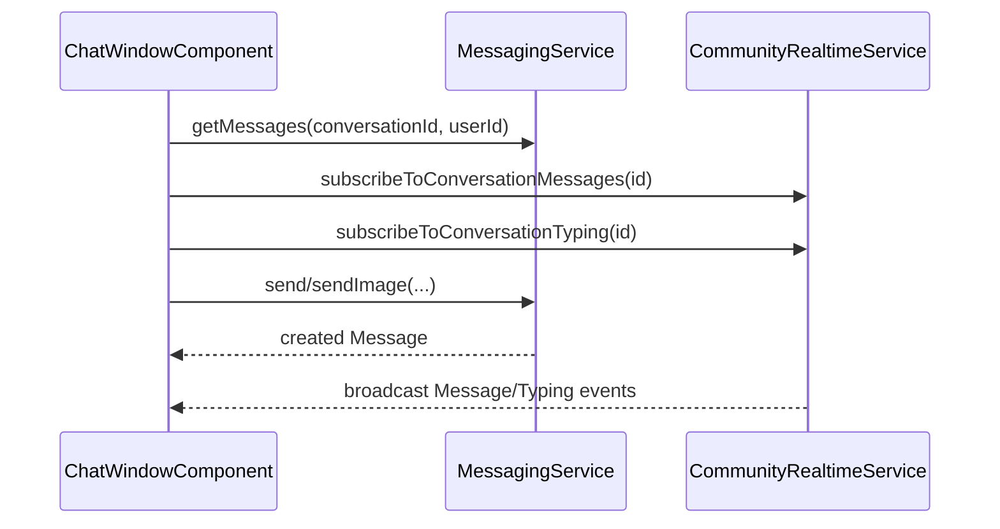

# Chat Window Component

`ChatWindowComponent` renders one conversation and combines HTTP persistence with realtime updates.

## Files

- `chat-window.component.ts`: message lifecycle, typing publish/subscribe, image/GIF send, read receipts.
- `chat-window.component.html`: message timeline, composer, attachment UI.
- `chat-window.component.css`: chat shell, bubbles, and state styles.

## Realtime Contract

- Subscribes to `/topic/community.conversation.{id}.messages`.
- Subscribes to `/topic/community.conversation.{id}.typing`.
- Publishes typing to `/app/community/typing`.

## Send Modes

- Text: `MessagingService.send`.
- Image file: `MessagingService.sendImage` with multipart file.
- GIF URL: `MessagingService.sendImage` with `imageUrl` payload.

## Mermaid Sequence

## Notes

- Duplicate message guards rely on message ID comparison.
- Typing publish is throttled by a local timeout; keep this in sync with UX expectations.
