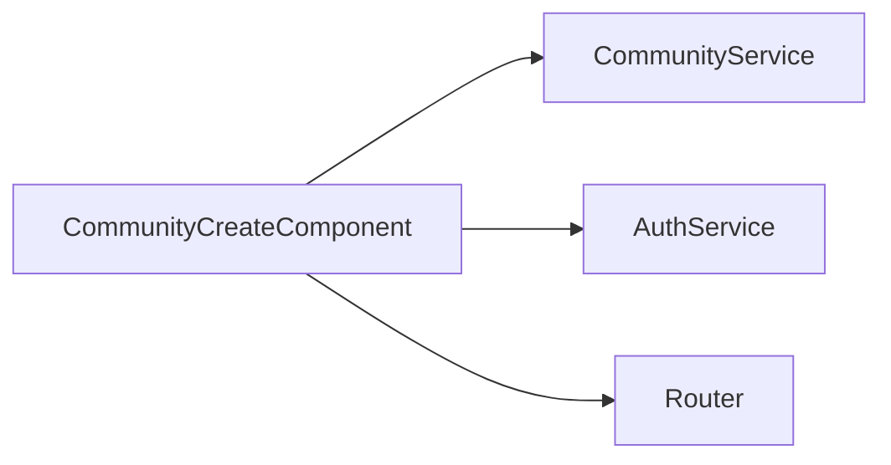

# Community Create Component

`CommunityCreateComponent` is a staged onboarding flow for creating communities and optional setup artifacts.

## Files

- `community-create.component.ts`: staged workflow (`stage` 1..4), create call, optional rules/flairs setup.
- `community-create.component.html`: multistep UI, previews, and checklist.
- `community-create.component.css`: staged card styling and responsive behavior.

## Runtime Flow

1. Stage 1 validates basics and calls `CommunityService.create`.
2. Stage 2 optionally creates rules.
3. Stage 3 optionally creates flairs.
4. Stage 4 confirms and navigates to created community slug.

## Integration Graph

## Notes

- Rule/flair setup is non-blocking by design; launch can proceed without them.
- Image payload size guard mirrors backend limits.
