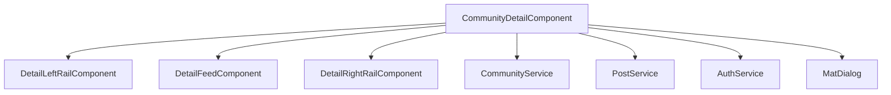

# Community Detail Component

`CommunityDetailComponent` is the main hub for a single community, loaded by slug.

## Files

- `community-detail.component.ts`: orchestration for loading community state, members, rules, flairs, posts, and moderation actions.
- `community-detail.component.html`: hub shell plus settings dialog template and action surfaces.
- `community-detail.component.css`: shared styles for rails, feed, and settings dialog skin.
- `detail-left-rail/`: visual left rail bound to host state.
- `detail-feed/`: feed controls and post list bound to host state.
- `detail-right-rail/`: right rail for metadata and quick actions.

## Core Responsibilities

- Membership actions: join/leave with role-aware UX.
- Feed control: sort + flair filtering + optimistic voting.
- Settings dialog: identity, rules, flairs, moderator management.
- Rule/flair CRUD and member role promotion/demotion.

## Authorization Surface

- `canEditCommunity`: creator/moderator role.
- `canManageModerators`: creator only.
- Post management actions permitted for author or moderator role.

## Visual Architecture

## Maintenance Notes

- Child rail/feed components are intentionally thin and should stay host-driven.
- Dialog classes (`community-settings-dialog-panel`, backdrop class) are shared contract points for UX consistency.
- Keep image payload guard (`1_500_000` chars) aligned with backend validation.
