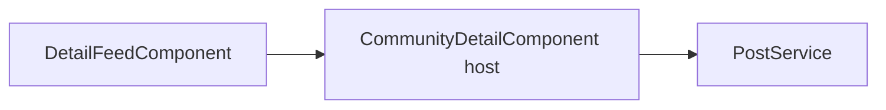

# Detail Feed Subcomponent

`DetailFeedComponent` renders the center feed area inside community detail.

## Files

- `detail-feed.component.ts`: typed bridge with required `host: CommunityDetailComponent` input.
- `detail-feed.component.html`: sort controls, flair controls, feed cards, action states.
- `detail-feed.component.css`: feed-only visual styles.

## Design Pattern

This component is presentational. Business logic stays in host methods such as `onSortChange`, `filterFlair`, and `onPostVote`.

## Relationship

