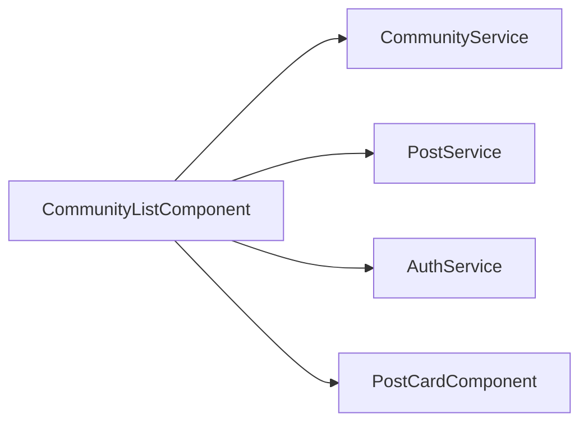

# Community List Component

`CommunityListComponent` is the discovery landing page for communities and cross-community trending posts.

## Files

- `community-list.component.ts`: loads communities/trending, filters, grouping, optimistic vote updates.
- `community-list.component.html`: split layout for discover grid, joined rails, and trending feed controls.
- `community-list.component.css`: themed visual language and responsive layout.

## Key Behaviors

- Pulls `CommunityService.getAll(userId?)` on init.
- Loads trending via `PostService.getTrending`, with fallback strategy that aggregates from top communities.
- Supports HOT/NEW/TOP/CONTROVERSIAL sorting for trending cards.
- Optimistic vote update with rollback on failed request.

## Relation Map

## Maintenance Notes

- Keep fallback ranking logic aligned with backend sort semantics.
- Any new sort mode must be added in UI controls and in the fallback comparator.
