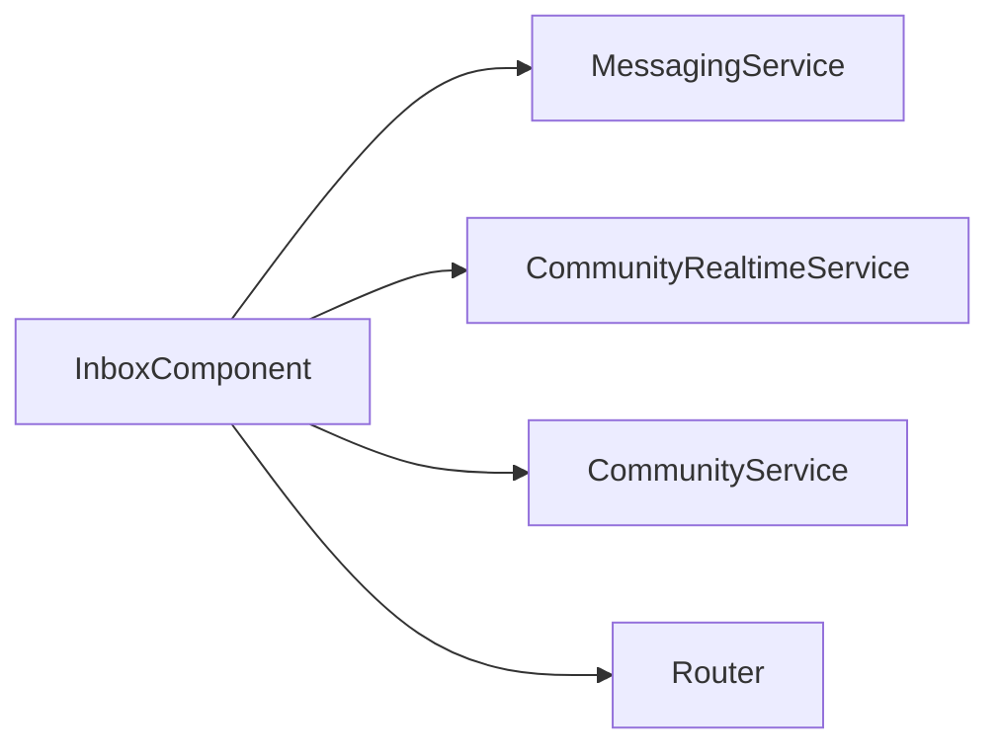

# Inbox Component

`InboxComponent` lists conversations and starts new chats with community members.

## Files

- `inbox.component.ts`: inbox load, presence subscription, candidate aggregation, chat start.
- `inbox.component.html`: conversation list + recipient picker modal.
- `inbox.component.css`: inbox layout and online-state styling.

## Core Behaviors

- Loads conversations from `MessagingService.getInbox`.
- Pulls initial online snapshot and then live presence events via `CommunityRealtimeService.observePresence`.
- Builds chat candidates by joining current member lists across joined communities.
- Starts or reuses a conversation through `MessagingService.startOrGet`.

## Flow

## Notes

- Candidate loading fans out requests (`forkJoin` over joined communities); watch cost as membership scale grows.
