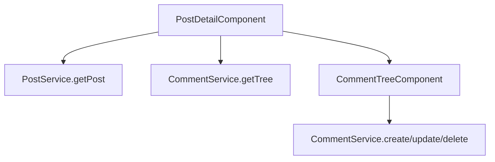

# Post Detail Component

`PostDetailComponent` owns single-thread rendering, post-level actions, and comment discussion orchestration.

## Files

- `post-detail.component.ts`: fetches post + comments, handles post edit/delete/pin, comment composer, accepted answer.
- `post-detail.component.html`: thread view, composer, comment tree mount point.
- `post-detail.component.css`: thread-focused layout and action styles.

## Collaborators

- `PostService`: load/update/delete/pin and vote operations.
- `CommentService`: tree loading and answer acceptance.
- `CommunityService`: community role context for moderation checks.
- `GifPickerDialogComponent`: comment GIF insertion.

## Flow Snapshot

## Notes

- Post edit is author-only in UI and backend.
- Delete/pin actions are exposed to author or community moderators.
