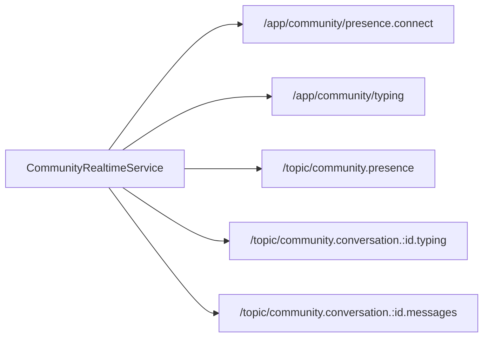

# Community Services

This folder centralizes transport and protocol concerns (REST headers, endpoint assembly, STOMP behavior).

## Service Responsibilities

| File                            | Responsibility                                                                   |
| ------------------------------- | -------------------------------------------------------------------------------- |
| `community.service.ts`          | community CRUD, membership, rules, flairs, moderator management                  |
| `post.service.ts`               | post CRUD, trending, keyword search, natural-language ask, pin/unpin, vote pass-through |
| `comment.service.ts`            | comment tree fetch + CRUD + accept answer                                        |
| `messaging.service.ts`          | inbox/messages/start chat/send text-send image/read/delete and media URL resolve |
| `community-realtime.service.ts` | STOMP connect/disconnect, presence stream, typing/message subscriptions          |
| `vote.service.ts`               | thin adapter over vote endpoints for comment/post usage                          |
| `gif.service.ts`                | GIF search proxy client                                                          |
| `notification.service.ts`       | lightweight in-app message bus                                                   |

## Header Contract

- `X-User-Id`: attached on authenticated flows.
- `X-Act-As-User-Id`: optional admin impersonation for selected endpoints.

## Realtime Contract

## Maintenance Notes

- Base URLs are currently hardcoded to localhost; migrate to environment configuration before deployment.
- Keep `resolveMediaUrl` behavior aligned with backend attachment endpoint semantics.
